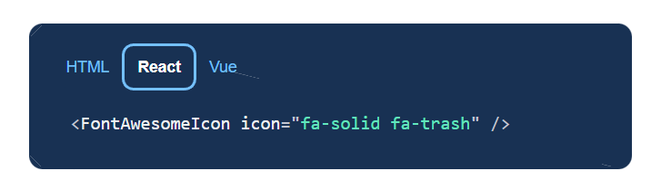

# Utiliser font awesome avec react
- installer les packages principaux
```
npm i --save @fortawesome/fontawesome-svg-core
npm i --save @fortawesome/react-fontawesome@latest
```
 
- installer le style de l'icône (solid - regular etc..)
```
npm i --save @fortawesome/free-solid-svg-icons
```

- utiliser une icône
au choix d'une icône, une pop-up se montre
on utilisait jusqu'à présent l'élément html `<i>`
en react -> dans la pop-up cliquer sur react et cliquer sur le composant pour le copier


dans le composant où injecter cette icône
- importer
```
import { FontAwesomeIcon } from '@fortawesome/react-fontawesome';
import { faTrash } from '@fortawesome/free-solid-svg-icons';
```

- insérer le composant
```jsx
<td>
    <FontAwesomeIcon icon={faTrash} />
</td>
```